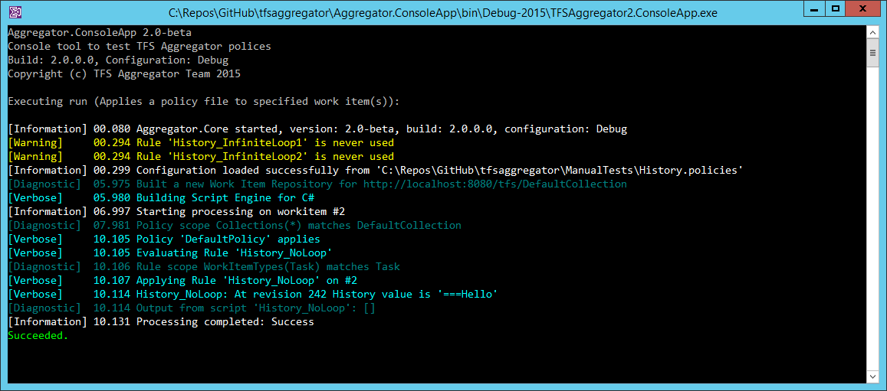
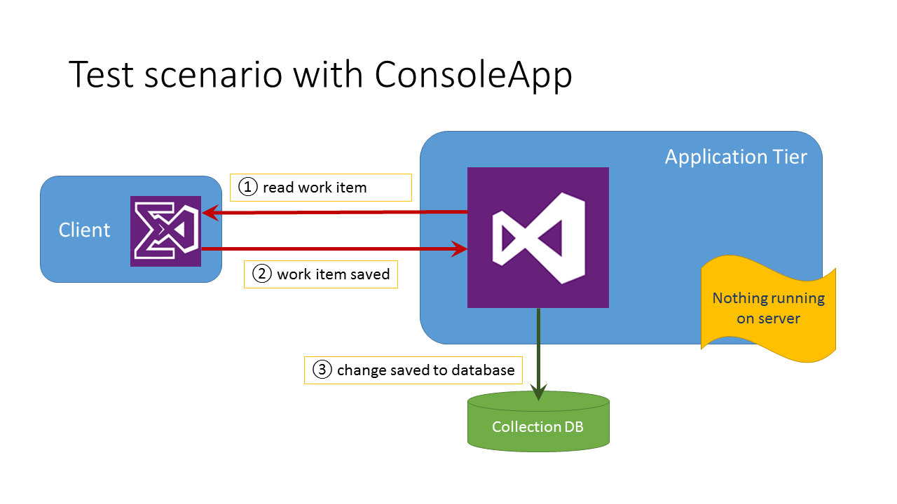

The `TFSAggregator2.ConsoleApp.exe` command line tool is extremely useful to test and validate
your policy files before applying to TFS.

> **BEWARE** Any changed workitem is written to TFS database! Use a test TFS instance.


## Syntax

```
 TFSAggregator2.ConsoleApp.exe <command> [<options>]
```
The only supported command is `run`.

If you launch the command without arguments, it will display an help screen. 

### Options
The available options are:

| Option <br> (short form) | Option <br> (long form) | Usage                                                                      |
|------|------------------------------------|-------------------------------------------------------------------------------------|
| `-h` | `--help`                           | Shows help message and exit                                                         |
| `-f` | `--policyFile=VALUE`               | Policy file to test                                                                 |
| `-c` | `--teamProjectCollectionUrl=VALUE` | TFS Team Project Collection Url, e.g. `http://localhost:8080/tfs/DefaultCollection` |
| `-p` | `--teamProjectName=VALUE`          | TFS Team Project                                                                    |
| `-n` | `--id=VALUE[,VALUE...] <br> --workItemId=VALUE[,VALUE...]` | List of Work Item Ids                                       |
| `-l` | `--logLevel=VALUE`                 | Logging level (critical, error, warning, information, normal, verbose, diagnostic)  |

The log level specified on the command line takes precedence over the level written in the policy file. 


### Sample invocation

```
TFSAggregator2.ConsoleApp.exe run --policyFile=samples\TFSAggregator2.ServerPlugin.policies --teamProjectCollectionUrl=http://localhost:8080/tfs/DefaultCollection --teamProjectName=TfsAggregatorTest1 --workItemId=42 --logLevel=diagnostic
```

### Sample output

The output from the previous invocation should be similar to the following screenshot. 




## Differences from TFS Plugin

Here are some major behavioral differences.

 * All logging is redirected to the console.
 * If a work item is changed by the rule, it will be processed again by the tool to emulate TFS behavior.
 * The order of processing may be different from TFS.
 * TFS may use different application tier servers to process rules.

The following diagrams may help understand the control flow.


**Normal flow using plugin**


**Development flow using Console Application**