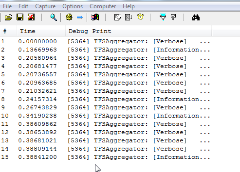
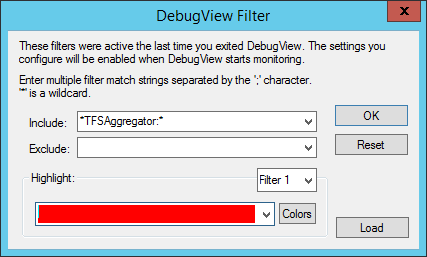

So you setup TFS Aggregator and it just sits there.... doing nothing...

Well, this is a check list of things to double check.


## Server Plugin Checklist

 -  You are using it on a TFS 2013 update 2 or later server
 - You installed the right version for your TFS server
   - You can verify if assembly version matches TFS version using this Powershell code

```
$pathToAssemblyFile = "C:\Program Files\Microsoft Team Foundation Server 15.0\Application Tier\Web Services\bin\Plugins\TFSAggregator2.ServerPlugin.dll"
[System.Reflection.Assembly]::LoadFile($pathToAssemblyFile).GetCustomAttributesData() | ?{ $_.AttributeType -eq [System.Reflection.AssemblyConfigurationAttribute] } | select ConstructorArguments
```

 -  You copied the DLLs and the Policies file to the plugins location on all TFS Application Tier Servers (Usually at: <Drive>`:\Program Files\Microsoft Team Foundation Server {version}\Application Tier\Web Services\bin\Plugins`)
 -  You have given permission to the user running the plugin, e.g. add the "TFS Service Account" to the **Project Collection Administrators** TFS Group.
  - You may have to do this from the commandline using `tfssecurity /collection:http://server:8080/tfs/DefaultCollection /g+ "Project Collection administrators" "LOCAL SERVICE"` if your service account is either LocalService, NetworkService or any other Windows Well-known identity, since they are no longer shown in the permission UI.
 -  When using the Impersonation option, make sure the user executing the plugin (generally the TFS Service account) has the "Make requests on behalf of others" [permission at the server level](https://msdn.microsoft.com/en-us/library/ms252587.aspx)
 -  If you upgraded your TFS from 2013.x to 2015.* or to 2017.* and from 2015 RTM to 2015.1 and did not uninstall the TFS Aggregator before doing this TFS upgrade the aggregator does not work. Remove the TFS Aggregator from the TFS 2013 Program Files folder or run the uninstall of the TFS Aggegrator (backup your policies!). Then re-install the TFS Aggegrator setup or install manually for TFS 2015 or 2017 [as described here](/admin/install). Every TFS version has its "own" assembly for the aggregator so it is important to use the right version against the right TFS.


Also if you are having issues we recommend debugging your Policies file using `TFSAggregator2.ConsoleApp.exe` and trying that out (see below).


## Web Service Checklist

As described in [How it Works](/intro/how-it-works) authentication goes both ways between TFS/VSTS and TFS Aggregator.


The call from VSTS to Web Service sends user and password in clear, protected by SSL, the values must match one entry of the Users section in Aggregator Web Service `web.config`

```
<Users>
    <add key="user1" value="password1" />
</Users>
```

This is not a real user (unless someone will offer Aggregator-as-a-Service), can be any printable string. I need it for two reasons:

 1. the Web Hooks configuration requires to enter some values and
 2. you can control access to a single TFS Aggregator instance setting different users, per project or per account.
 
The call from Aggregator Web Service to VSTS authenticates using a PAT issued by VSTS itself. Again, the PAT is listed in the policy to allow insulation between projects or accounts.


## Policy / Rules Checklist

 -  You have updated a work item that triggers a rule. (The TFS Aggregation only works once a work item that has aggregation rules on it is updated. This may change in a future version.)
 -  If the rule navigates between work items, work items have a proper Link (e.g. Parent-Child).
 -  You have valid names for source and destination fields in `TFSAggregator2.ServerPlugin.policies`.
 -  When you saved the policy file you saved it as UTF-8 encoding (in Notepad++ it is called “utf-8 without BOM”) (This should not be an issue, but it does not hurt to check).


## Use Console Application

The `TFSAggregator2.ConsoleApp.exe` command line tool is extremely useful to test and validate your policy files before applying to TFS.

**Sample invocation**

```
TFSAggregator2.ConsoleApp.exe run --logLevel=diagnostic --policyFile=samples\TFSAggregator2.ServerPlugin.policies --teamProjectCollectionUrl=http://localhost:8080/tfs/DefaultCollection --teamProjectName=TfsAggregatorTest1 --workItemId=42
```

See [Console Application](/admin/console-app) for more information on using the command line tool.


## Enable Debug Logging

You can also enable Logging. There are two parts to enable logging.

The first is that you have to set a `level` attribute to the `logging` element in your `TFSAggregator2.ServerPlugin.policies` file.
Use a value like `Verbose` or `Diagnostic`.

```
<?xml version="1.0" encoding="utf-8"?>
<AggregatorConfiguration>
    <runtime>
        <logging level="Diagnostic"/>
    </runtime>
```

Note that you can use the [`logger` object](/using/objects-reference/logger-object/) in your rules to trace execution and  values.

### Capturing log on TFS

Then you need to download [**DebugView**](https://technet.microsoft.com/en-us/sysinternals/debugview.aspx) from Microsoft's SysInternals site.

DebugView is a Trace Listener and will capture the trace messages from TFSAggregator.


> **You have to run DebugView on _all_ TFS Application Tier machines**.

We would recommend adding the `*TFSAggregator*` filter to DebugView so that you only see the TFSAggregator traces.



Make sure to enable the **Capture Global Win32** option.
Download DebugView at <http://technet.microsoft.com/en-us/sysinternals/bb896647>.

### Capturing log on Azure

See [Setup logging](/admin/install-webhooks/#setup-logging-optional).


## On-premise Production Logging (2.1)

TFS Aggregator log messages go to:

- Debug output (appers in the Output window of a debugger)
- Application EventLog (_TFS Aggregator_ source) when message level is `Warning` or `Critical`
- Trace listeners

User messages -- i.e. `logger.Log` calls in Rules -- use a specific Trace source: `TfsAggregator.User`.

Now, you can send traces to a file by adding to TFS `web.config` a `system.diagnostics` section similar to the this:

```
<system.diagnostics>
  <sources>
    <source name="TfsAggregator.ServerPlugin" switchValue="All">
      <listeners>
        <remove name="Default" />
        <add name="filelog" />
      </listeners>
    </source>
    <source name="TfsAggregator.User" switchValue="All">
      <listeners>
        <remove name="Default" />
        <add name="filelog" />
      </listeners>
    </source>
  </sources>
  <sharedListeners>
    <add name="filelog"
         type="Microsoft.VisualBasic.Logging.FileLogTraceListener, 
                   Microsoft.VisualBasic, Version=10.0.0.0, 
                   Culture=neutral, PublicKeyToken=b03f5f7f11d50a3a"
         BaseFileName="TfsAggregator.log"
         DiskSpaceExhaustedBehavior="ThrowException"
         Location="Custom"
         CustomLocation = "C:\Temp"
         MaxFileSize="81920000"
         LogFileCreationSchedule="Daily"/>
  </sharedListeners>
  <trace autoflush="true"/>
</system.diagnostics>
```

TFS web.config is usually located in `C:\Program Files\Microsoft Team Foundation Server 15.0\Application Tier\Web Services\web.config` or similar.

