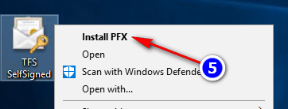
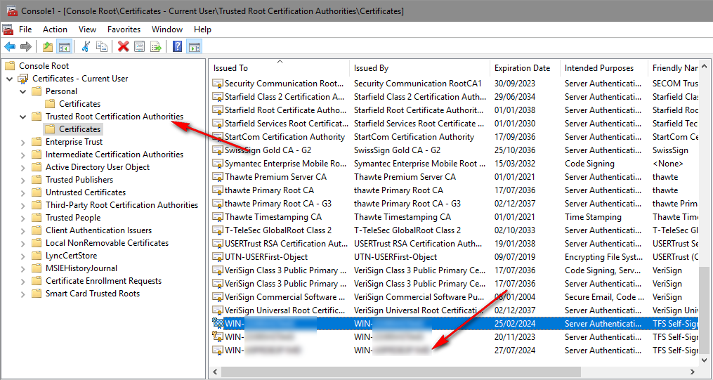

For the best development experience, use a TFS Virtual Machine with Visual Studio 2017 installed and work directly on the machine.

> **Do not _ever_ debug on a production server!**


## Server Plugin

You can then set the output folder for the project to
`C:\Program Files\Microsoft Team Foundation Server 12.0\Application Tier\Web Services\bin\Plugins\`
or use the `deploy.cmd` file in _Aggregator.ServerPlugin_ project to refresh Aggregator's assembly on a target test system. Here is a sample

```
@echo off
set CONFIGURATION=%1
set TARGETDIR=%2
set PLUGIN_FOLDER=C:\Program Files\Microsoft Team Foundation Server 14.0\Application Tier\Web Services\bin\Plugins

echo Deploy '%CONFIGURATION%' from '%TARGETDIR%' to '%PLUGIN_FOLDER%'

copy /Y "%TARGETDIR%\TFSAggregator2.Core.dll" "%PLUGIN_FOLDER%"
copy /Y "%TARGETDIR%\TFSAggregator2.Core.pdb" "%PLUGIN_FOLDER%"
copy /Y "%TARGETDIR%\TFSAggregator2.ServerPlugin.dll" "%PLUGIN_FOLDER%"
copy /Y "%TARGETDIR%\TFSAggregator2.ServerPlugin.pdb" "%PLUGIN_FOLDER%"
copy /Y "%TARGETDIR%\TFSAggregator2.ServerPlugin.dll.config" "%PLUGIN_FOLDER%"

IF NOT EXIST "%PLUGIN_FOLDER%\TFSAggregator2.ServerPlugin.policies" (
    copy "samples\TFSAggregator2.ServerPlugin.policies" "%PLUGIN_FOLDER%"
)

echo Deploy complete.
```

Do not commit changes to this file!

To debug attach to the `w3wp.exe` on the server and set breakpoints as you would normally.

> Note. Use `12.0` for TFS 2013, `14.0` for TFS 2015 and `15.0` for TFS 2017.


### Remote Debugging

TFS is not required to successfully build and debug Aggregator. In fact we successfully used [Remote Debugging](https://msdn.microsoft.com/en-us/library/y7f5zaaa.aspx).

See [Local build](/contrib/local-build) for additional details.


## Web Service

If TFS is running on a different machine, e.g. a VM. you have to permit incoming connections to IIS Express.

Say that the machine running Visual Studio has address `192.168.192.168` and the `Aggregator.WebHooks.csproj` listen on `http://localhost:54145/`.

Steps:

 1. Add `<binding protocol="http" bindingInformation="*:54145:192.168.192.168" />` below `<binding protocol="http" bindingInformation="*:54145:localhost" />` to `.vs\config\applicationhost.config`
 2. Run `netsh http add urlacl url=http://192.168.192.168:54145/ user=everyone` from an elevated prompt
 3. `netsh advfirewall firewall add rule name="IISExpressWeb" dir=in protocol=tcp localport=54145 profile=private remoteip=localsubnet action=allow`
 4. Export the TFS SSL certificate  
 5. Copy the PFX file on the host machine and import as Trusted root
   


```
 iisexpress.exe Error: 0 : [Critical]    01.410 faf47830-acf6-4fde-b9bf-6c99118f8c1d Exception encountered processing notification: TF400324: Team Foundation services are not available from server https://name-of-tfs-server/DefaultCollection/.
Technical information (for administrator):
  The underlying connection was closed: Could not establish trust relationship for the SSL/TLS secure channel. 
```