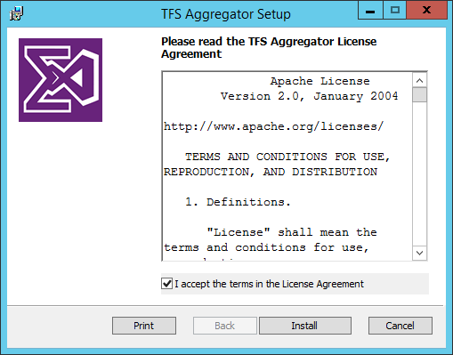
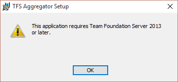
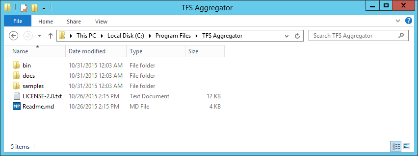

> This information does **not** apply to the Web Service version.

## Pre-requisites

### TFS ###

The TFS Aggregator works with the following versions of TFS:

 * TFS 2013 update 2,3,4,5
 * TFS 2015 RTM
 * TFS 2015 update 1,2,3
 * TFS 2017 RTM
 * TFS 2017 update 1
 * Azure DevOps Server 2019
 * Azure DevOps Server 2020
 * Azure DevOps Server 2022 

The installer will detect the correct TFS version and will install the appropriate binary. If you're upgrading, please uninstall your current TFS Aggregator version, upgrade TFS, then run the installer to automatically install the matching version.

### Windows Event log

The TFS Aggregator plugins writes to Windows Event log critical errors; the **TFSAggregator** Source must be defined in the Application log. The MSI takes care of this.

### Account permissions

The TFS service account must have permissions to change your work items (on behalf of others if you have enabled impersonation).


## Automated Setup using Windows Installer

Download TFSAggregator MSI file from the latest [Release](https://github.com/tfsaggregator/tfsaggregator/releases).

Unblock the downloaded file.


Launch the installer and accept the license



The MSI packages all three Aggregator flavors, one for each supported TFS version.
The installer detects the TFS version installed and deploy the correct assemblies.

> **The installer detects automatically the TFS version: it fails if TFS is not present.**



It will install under `%ProgramFiles%`, typically `C:\Program Files\TFS Aggregator`, three folders: `bin`, `docs` and `samples`.


Furthermore it installs the plugin in the proper directory &mdash; for TFS 2017 can be `C:\Program Files\Microsoft Team Foundation Server 15.0\Application Tier\Web Services\bin\Plugins` &mdash; the plugin assemblies and the default no-op Policy file `samples\TFSAggregator2.ServerPlugin.policies`.
> **An existing Policy file is not overwritten.**


### Sample Install scripts

In the `samples` folder you will find two Powershell scripts to install or remove Aggregator in case the TFS Administrator does not want (or can) use the MSI file. 
The scripts require an elevated Powershell prompt.


## Configure

To configure Aggregator you must add new rules in the policy file.
 
 1. Edit a copy of the sample `TFSAggregator2.ServerPlugin.policies` file.
 2. Test your new policy using `TFSAggregator2.ConsoleApp.exe` command line tool
 3. Copy the new file to the plugin folder; usually at this path for TFS 2017:
    `C:\Program Files\Microsoft Team Foundation Server 15.0\Application Tier\Web Services\bin\Plugins` 
 4. Verify that your new policy works; see [TFS Aggregator Troubleshooting](/admin/troubleshooting) in case of problems.

See [Console Application](/admin/console-app) for more information on using the command line tool.

## Upgrade TFS to a new version
Due to the fact that there have been breaking changes between TFS Server Object Model versions, there may be a need to fix the TFS aggregator after an upgrade.

When upgrading TFS / Azure DevOps Server, you need to uninstall TFS aggregator before upgrading the Application Tier server re-install it afterwards.

An uninstall+reinstall is required, repairing may not work. TFS will detect the incompatibility and will not load the plugin if the version mismatches.

## Manual Setup


### Manual install

 1. Download and extract the binaries from the latest release
 2. Create `TFSAggregator2.ServerPlugin.policies` using one of the provides examples to build your actual policy.
    - You will find the [complete syntax](/using/policy-syntax) and [examples](/using/policy-examples) following the links.
 3. Test your policy using  `TFSAggregator2.ConsoleApp.exe` command line tool, see [TFS Aggregator Troubleshooting](/admin/troubleshooting).
 4. Register the EventLog source for TFS Aggregator, using an elevated Powershell prompt, by running
    ```
New-EventLog -LogName "Application" -Source "TFSAggregator"
    ```
 5. Copy `TFSAggregator2.ServerPlugin.dll`, `TFSAggregator2.Core.dll` and `TFSAggregator2.ServerPlugin.policies` to the plugin location on the Application Tier of your TFS Servers:
     - The plugin folder is usually at this path for TFS 2017: `C:\Program Files\Microsoft Team Foundation Server 15.0\Application Tier\Web Services\bin\Plugins`;
     - You must copy the exact same files on all TFS Application Tier servers.

TFS detects automatically that a file was copied in and will load it in.

You can verify if assembly version matches TFS version using this Powershell code

```
$pathToAssemblyFile = "C:\Program Files\Microsoft Team Foundation Server 15.0\Application Tier\Web Services\bin\Plugins\TFSAggregator2.ServerPlugin.dll"
[System.Reflection.Assembly]::LoadFile($pathToAssemblyFile).GetCustomAttributesData() | ?{ $_.AttributeType -eq [System.Reflection.AssemblyConfigurationAttribute] } | select ConstructorArguments
```


### Manual Uninstall

Remove the `TFSAggregator2.*` files from the plugin location on the Application Tier of your TFS Servers

The plugin folder is usually at this path:

 - TFS 2015: `C:\Program Files\Microsoft Team Foundation Server 14.0\Application Tier\Web Services\bin\Plugins`
 - TFS 2013: `C:\Program Files\Microsoft Team Foundation Server 12.0\Application Tier\Web Services\bin\Plugins`
