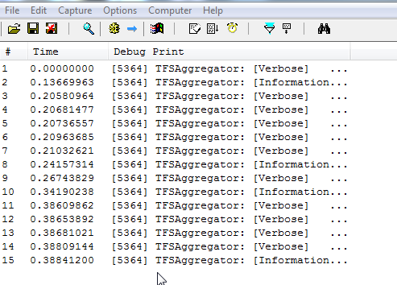
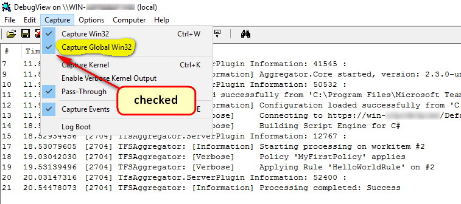
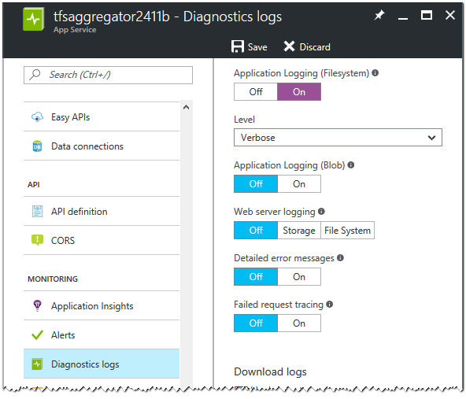

TFS Aggregator logging is quite rich but the exact configuration depends on your environment.


## Logging levels

The possible Logging levels are: `Critical`, `Error`, `Warning`, `Information` or `Normal`, `Verbose`, and `Diagnostic`.


## Enable Debug Logging

To control the verbosity in TFS Aggregator, you have to set a `level` attribute to the `logging` element in your `TFSAggregator2.ServerPlugin.policies` file.
Use a value like `Verbose` or `Diagnostic`.

```
<?xml version="1.0" encoding="utf-8"?>
<AggregatorConfiguration>
    <runtime>
        <logging level="Diagnostic"/>
    </runtime>
```

Note that you can use the [`logger` object](/using/objects-reference/logger-object/) in your rules to trace execution and  values.


## Startup logging (2.3)

During TFS Aggregator start, before the Policies file is read, the logging level is controlled by `TFSAggregator2.ServerPlugin.dll.config`, for the Server Plugin, and by `Web.config`, for the Web Service, through the `DefaultLoggingLevel` key in the `appSettings` section, as in this example.

```
<configuration>
  <appSettings>
    <add key="DefaultLoggingLevel" value="Verbose"/>
  </appSettings>
</configuration>
```
If the file or section is absent, the default value is `Normal`.


## Capturing log on TFS

For TFS on premises or hosted, you can download [**DebugView**](https://technet.microsoft.com/en-us/sysinternals/debugview.aspx) from Microsoft's SysInternals site.

DebugView is a Trace Listener and will capture the trace messages from TFS Aggregator.


> **You have to run DebugView on _all_ TFS Application Tier machines**.

We would recommend adding the `*TFSAggregator*` filter to DebugView so that you only see the TFS Aggregator traces.


Make sure to enable the **Capture Global Win32** option.


Download DebugView at <http://technet.microsoft.com/en-us/sysinternals/bb896647>.


## Capturing log on Azure

In this scenario you deployed the TFS Aggregator Web Service using the _Deploy to Azure_ button.

In the [Azure Portal](https://portal.azure.com/) navigate to **App Services** and select the App Service hosting TFS Aggregator. Scroll down to **Diagnostic logs** and turn on **Application Logging**.



Select the Verbosity level and save.

> You can store the logs in Azure storage for auditing.

In the Kudu console navigate to the `LogFiles\Application` folder to find the log files produced by TFS Aggregator.


By opening the file you see a snapshot of log file's content.


## TFS Production Logging (2.1)

TFS Aggregator log messages go to:

- Debug output (appers in the Output window of a debugger)
- Application EventLog (_TFS Aggregator_ source) when message level is `Warning` or `Critical`
- Trace listeners

User messages -- i.e. `logger.Log` calls in Rules -- use a specific Trace source: `TfsAggregator.User`.

Now, you can send traces to a file by adding to TFS `web.config` a `system.diagnostics` section similar to the this:

```
<system.diagnostics>
  <sources>
    <source name="TfsAggregator.ServerPlugin" switchValue="All">
      <listeners>
        <remove name="Default" />
        <add name="filelog" />
      </listeners>
    </source>
    <source name="TfsAggregator.User" switchValue="All">
      <listeners>
        <remove name="Default" />
        <add name="filelog" />
      </listeners>
    </source>
  </sources>
  <sharedListeners>
    <add name="filelog"
         type="Microsoft.VisualBasic.Logging.FileLogTraceListener, 
                   Microsoft.VisualBasic, Version=10.0.0.0, 
                   Culture=neutral, PublicKeyToken=b03f5f7f11d50a3a"
         BaseFileName="TfsAggregator.log"
         DiskSpaceExhaustedBehavior="ThrowException"
         Location="Custom"
         CustomLocation = "C:\Temp"
         MaxFileSize="81920000"
         LogFileCreationSchedule="Daily"/>
  </sharedListeners>
  <trace autoflush="true"/>
</system.diagnostics>
```

TFS web.config is usually located in `C:\Program Files\Microsoft Team Foundation Server 15.0\Application Tier\Web Services\web.config` or similar.

