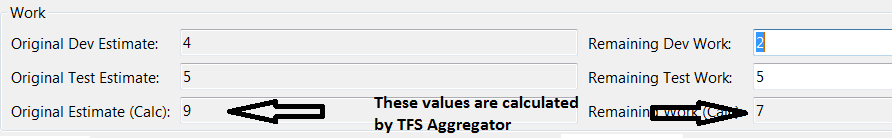

## Sample polices

The Unit tests use policy files from `UnitTests.Core\ConfigurationsForTests` folder, this are the most correct and tested. They do not show how to solve real world 

The `samples\TFSAggregator2.ServerPlugin.policies` should be your **starting point**. This file contains a no-harm policy: it simply logs an "_Hello, World_" message when invoked. The comments remind the syntax. 

From time to time, we test the policies contained in the `ManualTests` folder. They are good to learn but should not be trusted 100%, at least until we are able to setup automated integration testing.


## Simple rules

### Calculated field

```
<rule name="Sum" appliesTo="Task" hasFields="Title,Description"><![CDATA[
    self["Estimated Work"] = (double)self["Estimated Dev Work"] + (double)self["Estimated Test Work"];
]]></rule>
```

This aggregation will total the values found in the Estimated Dev Work and Estimated Test Work fields for any Task work item.
The total will be placed in the Estimated Work field on the same work item as the source values were found.



### Rollup field on parent

```
<rule name="Rollup" hasFields="Estimated Dev Work;Estimated Test Work"><![CDATA[
  if (self.HasParent()) {
    self.Parent["Total Estimate"] = (double)self.Parent["Estimated Dev Work"] + (double)self["Estimated Test Work"];
  }
]]></rule>
```

This aggregation will total the values found in the Estimated Dev Work and Estimated Test Work fields for all Task work items on the parent.
The total will go in the Total Estimate field on the parent one level up from the Task (i.e. the direct parent).
In the Microsoft Visual Studio Scrum template that is always a Bug or Product Backlog Item. 

> **Note on States**: TFS has controls setup on State Transitions.
> Most templates do not allow you to go directly from a New state to a Done state.


## Pick children satisfying condition

```
var child in self.Children.Where(
   child => child.Field.Any(
      field => field.ReferenceName == "Custom.Product")
);
```
