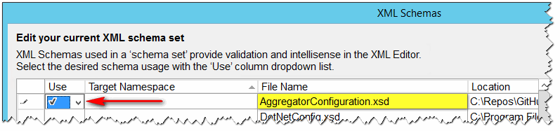

The `samples\TFSAggregator2.ServerPlugin.policies` should be your **starting point**. This file contains a no-harm policy: it simply logs an "_Hello, World_" message when invoked. The comments remind the syntax. 

## Editing a policy

The XML Schema definition is in file `Aggregator.Core\Configuration\AggregatorConfiguration.xsd`. This is the ultimate truth: policy file is checked against XSD before being used.

It can also help you editing the policy file in Visual Studio.
Open TfsAggregator2 solution in Visual Studio, open a policy file using built-in Xml editor, Select **XML** from the main menu, then **Schemas**. In the dialog windows select **Use this Schema** for `AggregatorConfiguration.xsd` from the drop-down list.

