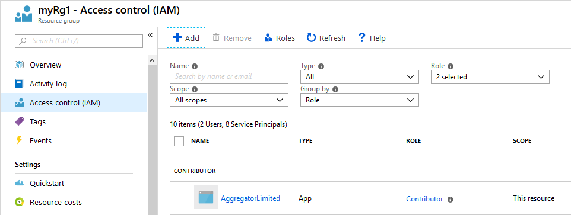

# Aggregator 3 (CLI & Docker)

This is the successor to renowned TFS Aggregator.
The current Server Plugin version (2.x) will be maintained to support TFS.
The Web Service flavour will be discontinued in favour of this new tool for two reasons:
- deployment and configuration of Web Service was too complex for most users;
- both the Plugin and the Service rely heavily on TFS Object Model which is [deprecated](https://docs.microsoft.com/en-us/azure/devops/integrate/concepts/wit-client-om-deprecation).

Aggregator 3.x supports two scenarios:
 1. Azure DevOps Services with Rules running in Azure Functions.
 2. Docker container running in the cloud or on-premise. [v1.0]

The latter permits replacing the Server Plugin after migrating the Rule code.

## Releases

Download CLI
Docker Image from DockerHub
Docker Image from GitHub Container Registry

Aggregator is evolving rapidly and some feature are not available on older versions.
A release number like `[v0.9.11]` signals the version when the feature was introduced.
A complete list of releases including log of changes is [in GitHub](https://github.com/tfsaggregator/aggregator-cli/releases).

## Major features

- use of new Azure DevOps REST API
- simple deployment via CLI tool or Docker container
- Rule language similar to TFS Aggregator v2

### What you can and cannot do

Aggregator is always 1 save away from the Azure DevOps User Interface: it does not intercept anything. Aggregator is notified _after_ Azure DevOps commits user changes to the database. It can do fancy calculations and can work across hierarchies and queries (which the built-in rules won't allow), but needs additional round-trips to Azure DevOps. Thus it is only reactive and may need a UI refresh for calculations to show up.
It cannot be used to block updates either. The data has already been saved once the aggregator runs. You could do compensating changes, but can't prevent them.
When aggregator changes a value, it will also invoke itself once more (it runs on every change), so Aggregator rules must run idempotent.  
Please go to the [Design](design/) section for further details.

## Requirements

To write a Rule is required some basic knowledge of C# language and Azure Boards.
In addition you need:
- an Azure DevOps Services Project
- a Personal Access Token with sufficient permissions on the Project

### CLI & Azure
The CLI scenario has two additional requirements:
- an Azure Subscription
- a Service Principal with, at least, Contributor permission on a Resource Group of the Subscription

### Docker
The Docker scenario requires:
- an SSL Certificate
- an host for Docker containers (Windows or Linux)

## How the CLI works with Azure Functions

As the name implies, this is a command line tool: you download the latest aggregator-cli*.zip appropriate for your platform from GitHub [releases](https://github.com/tfsaggregator/aggregator-cli/releases) and unzip it on your client machine.
Read more below in the [Usage](#usage) section.

Through the CLI you create one or more Azure Functions in your Subscription. The Functions use a library named Aggregator **Runtime** to run your **Rules**.
A Rule is code that reacts to one or more Azure DevOps event; currently, the only language for writing rules is C#.

The CLI automatically checks GitHub Releases to ensure that you use the more recent version of Aggregator Runtime available. To avoid automatic upgrades, specify the Runtime version or point to a specific Runtime package file, using an `http:` or `file:` URL.

After you setup the Rules in Azure, you must add at least one **Mapping**. A mapping is an Azure DevOps Service Hook that send a message to the Azure Function when a specific event occurs. Currently we support only Work Item events.
When triggered, the Azure DevOps Service Hook invokes a single Aggregator Rule i.e. the Azure Function hosting the Rule code. Azure DevOps saves the Azure Function Key in the Service Hook configuration.

You can deploy the same Rule in different Instances, map the same Azure DevOps event to many Rules or map multiple events to the same Rule: you choose the best way to organize your code.

## CLI Authentication

You must instruct Aggregator which credential to use.
To do this, run the `login.azure` and `login.ado` commands.

To create the credentials, you need an Azure Service Principal and a Azure DevOps Personal Access Token. Full details in the [Setup](setup/) section.

Aggregator stores the logon credentials locally and expires them after 2 hours.

The PAT is also stored in the Azure Function settings: **whoever has access to the Resource Group can read it!**

The Service Principal must have Contributor permission to the Azure Subscription or, in alternative, pre-create the Resource Group in Azure and give the service account Contributor permission to the Resource Group.

If you go this route, remember add the `--resourceGroup` to all commands requiring an instance.

For Docker only Azure DevOps logon is required.

## CLI Usage

Download and unzip the latest CLI.zip file from [Releases](https://github.com/tfsaggregator/aggregator-cli/releases).
It requires [.Net Core 3.1](https://dotnet.microsoft.com/download/dotnet-core/3.1) installed on the machine.
To run Aggregator run `aggregator-cli.exe` (Windows), `aggregator-cli` (Linux) or `dotnet aggregator-cli.dll` followed by a verb and its options.

### CLI Verbs

There are about 20 commands described in detail at [Commands](commands/).

They can be grouped in a few categories:
* Authentication to logon into Azure and Azure DevOps.
* Instance creation, configuration and update.
* Rule deployment, configuration and update.
* Mapping from Azure DevOps to Rules.
* Informational commands, to read configuration.
* Testing commands to validate configuration.

Most commands manage Azure Function, but a few can be used in the Docker scenario.

We collected some usage scenarios at [Command Examples](commands/command-examples/).

## How the Docker image works

Pull the latest image from [Docker Hub](https://hub.docker.com/repository/docker/tfsaggregator/aggregator3). It works on Linux and Windows.
Start a container with the image, setting configuration through environment variables.
The Rules are simply files on a Docker volume that the container uses.
The container must expose a port reachable from your Azure DevOps instance, either Server or Service.
Add one or web hook to Azure DevOps using the container URL. Use one Aggregator API Key to authenticate the call. You may use the CLI to add these mappings.

More details at [Docker configuration](setup/docker/)

## Rule language

Currently we offer only C# as the language to write Rules. The Rules can access a few objects:
* The Current Work Item.
* Work Item Store to retrieve additional Work Items.
* The Event which triggered the Rule.
* Project information.
* A Logger object to track Rule steps.

See [Rule Language](rules/) for a list of objects and properties to use.
For examples see [Rule Examples](rules/rule-examples-basic/).

## Maintenance

Aggregator stores the PAT in the Azure Function configuration. Before the PAT expire you should refresh it from Azure DevOps or save a new PAT using the `configure.instance` command.

Read [Production Configuration and Administration](setup/production/) for recommendations on running Aggregator in production.

## Troubleshooting

Tips and suggestion when things do not work are in the [Troubleshoot](troubleshoot/) section.

## Contributing

Details on building your own version and testing are in the [Contribute](contrib/) section.
