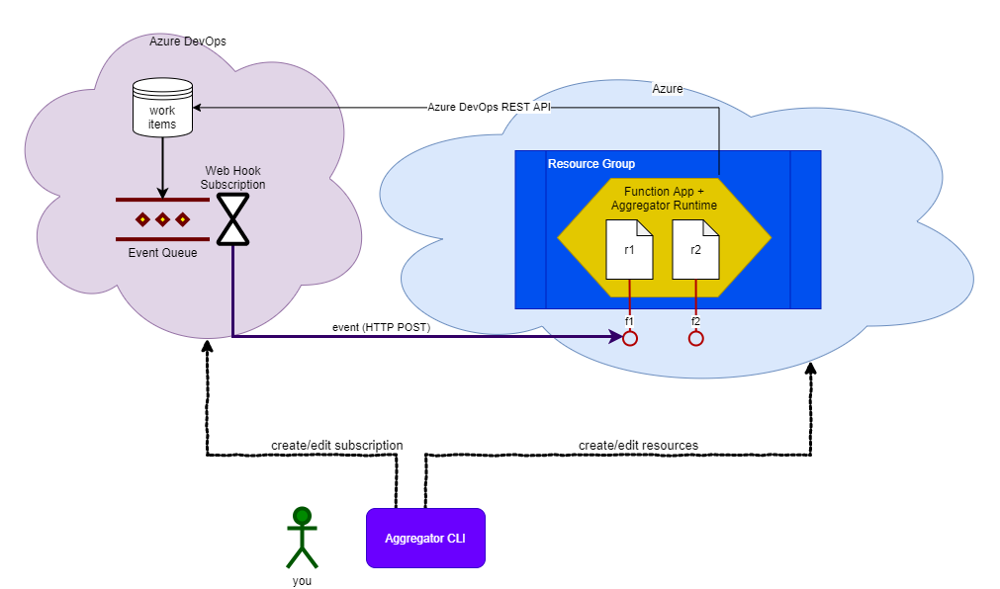
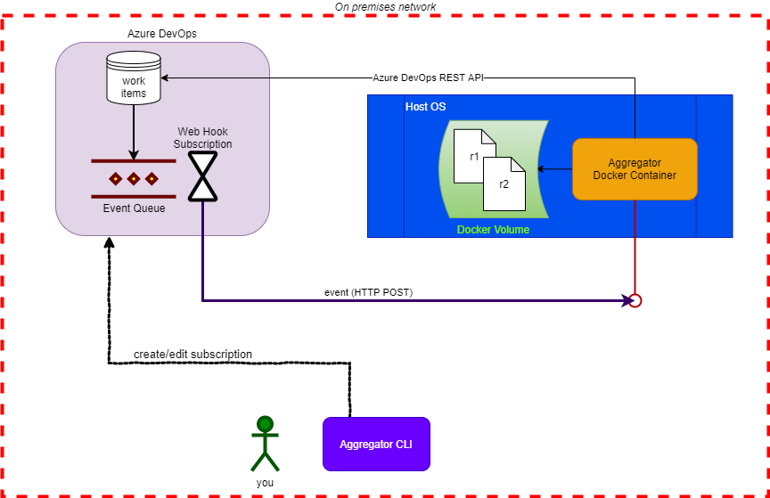

In this page we want to explain the overall design and principles behind Aggregator.

## Overview

The Azure DevOps Service scenario (cloud) is best served by hosting Aggregator in an Azure Function App. The next diagram illustrates the relation between the major components of the cloud scenario.

The Azure DevOps Server scenario (on premises) is best served by using the Aggregator Docker image. The next diagram illustrates the relation between the major components of the on premises scenario.

## Major components

### CLI

Through the CLI you manage the Aggregator configuration. A configuration can be quite complex encompassing Azure Resources, Azure DevOps objects or Docker containers.

### Instance

An Aggregator Instance is a process that hosts the Rule Interpreter and exposes it via one or more endpoints.

In the cloud scenario it is an Azure Function Application in its own Resource Group,
sharing the same Azure DevOps Service credential and version of Aggregator Runtime.
*Note*: The name you pick for the Instance must be **unique** amongst all
Aggregator Instances in Azure! This is a consequence of the uniqueness of Azure Function Application DNS hostname.

You can have more than one Instance, for example a staging instance with limited computational resource and a production instance.

You can host an Instance in a Docker container. In this case, you have full control of the host environment. It can run on premises or in the cloud, as long as it can be reached by Azure DevOps. Note that you can host the container on Windows and on Linux.

### Rule Interpreter (Aggregator Runtime)

The Rule Interpreter parses and executes the Rule file when triggered by an event. You can manually run the interpreter emulating an event via CLI.

The Rules must be previously uploaded to the hosting environment. This is a docker volume or an Azure Function.

The CLI checks the Interpreter version deployed on Azure Function. If there is a more recent version in GitHub Releases, the Interpreter is updated, unless the user has specified a desired version. In this latter case if the runtime does not match the version requested by the user, CLI uploads the one requested by the user.

### Rules

A Rule is code that reacts to one or more Azure DevOps event.
The Rule language is C# (hopefully more in the future) and uses Aggregator Runtime which exposes an object model to interact with data received in the event or later requested from Azure DevOps.

### Mapping

An Aggregator **Mapping** is an Azure DevOps Service Hook Subscription triggered by a specific event. Currently we support only Work Item events.
When triggered the Service Hook Subscription invokes a single Aggregator Rule. Azure DevOps saves the authentication secret (an Azure Function Key or an API Key) in the Service Hook configuration.
Each event requires a unique Subscription, the same event can be monitored by more than one Subscription, and more than one Subscription can invoke the same Rule URL.

## Relationship between components

You can deploy the same Rule in different Instances, map the same Azure DevOps event to many Rules or map multiple events to the same Rule: it is up to you choosing the best way to organize.
