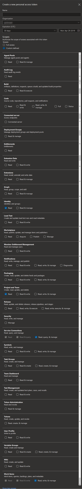
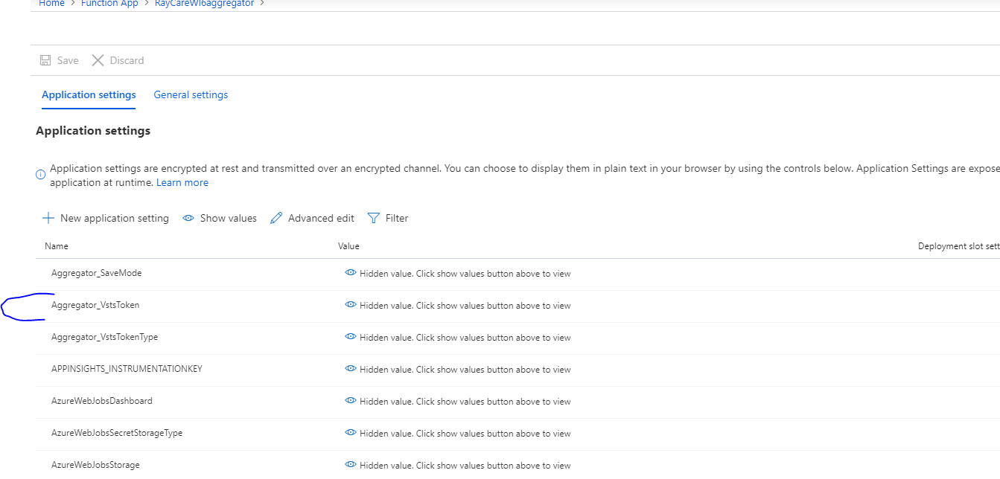

# Azure DevOps Personal Access Token (PAT)

The below instructions are based on [Create personal access tokens to authenticate access](https://docs.microsoft.com/en-us/azure/devops/organizations/accounts/use-personal-access-tokens-to-authenticate).

A PAT has the same or less permissions than the person/identity that creates it.
We recommend that the PAT is issued by an Azure DevOps Organization Administrator Identity.


Keep in mind that a PAT has a limited timespan and must be periodically renewed. If you don't, the Rules will stop working.


When using the [impersonate directive](../../rules/directives#impersonate-directive), 
[mapping a rule](../../commands/map-commands/)
to execute impersonated or 
[configuring a rule impersonated](../../commands/command-examples#execute-impersonated),
the used identity for creating the PAT must have the permission: 
"Bypass rules on work item updates"

Aggregator needs at least the following Scopes:

- Identity: Read
- Project & Team: Read
- Service connections: Read, query & manage
- Work Items: Read, write & manage

Careful with the Expiration: Aggregator stores the PAT in the Azure Function configuration, allowing the rules to access Azure DevOps. You should refresh the PAT before expires or save a new PAT in Aggregator configuration using the `configure.instance` command.

## Renew Azure DevOps Personal Access Token (PAT)

Azure DevOps Personal Access Token (PAT) expires and is up to the administrator to renew or replace them.
Aggregator stores the PAT in the Azure Function configuration, allowing the rules to access Azure DevOps. You should refresh the PAT before expires or save a new PAT in Aggregator configuration using the `configure.instance` command.

