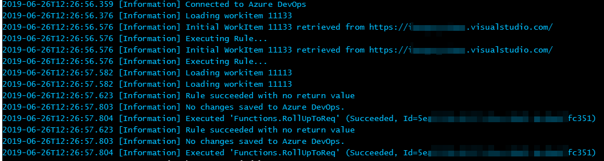

# Production Configuration and Administration of Azure Functions


## Renew Azure DevOps Personal Access Token (PAT)

Azure DevOps Personal Access Token (PAT) expires and is up to the administrator to renew or replace them.
Aggregator stores the PAT in the Azure Function configuration, allowing the rules to access Azure DevOps. You should refresh the PAT before expires or save a new PAT in Aggregator configuration using the `configure.instance` command.


## Control Azure performance and costs

You can specify the size for the Virtual machine running the rules using the `hostingPlanSku` and `hostingPlanTier` options. The defaults are **Y1**/**Dynamic**, known as [Consumption plan](https://docs.microsoft.com/en-us/azure/azure-functions/functions-scale#consumption-plan). You can select a [Premium plan](https://docs.microsoft.com/en-us/azure/azure-functions/functions-scale#premium-plan) instead, like **Premium**/**P2V2** for example.


## Azure Production monitoring

[Disable built-in logging](https://docs.microsoft.com/en-us/azure/azure-functions/functions-monitoring#disable-built-in-logging) and use Application Insights.
Build-in log streaming is useful only for developers as it may skip or duplicate messages as in this picture.



## Azure Troubleshooting

For limited testing you can use the stream command: it connects for 30 minutes to the Azure Application and prints the logging messages.
```Batchfile
stream.logs --instance my7 --resourceGroup test-aggregator7 --verbose
```
You can stop the program using `Ctrl+C` keystroke or closing the command window.

The traces generated by the Aggregator Rule Engine are sent to the Application Insight instance that was created aside the Azure Function.
More information on Application Insights can be found in [Azure documentation](https://docs.microsoft.com/en-us/azure/azure-monitor/app/app-insights-overview).
