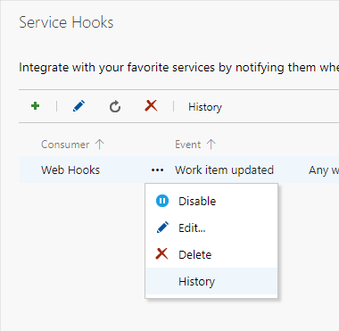

Please make sure you are familiar with Aggregator design as explained in [Design](../design/).

# Troubleshooting Azure Function

Check things are in the right place with the correct names using the [informational commands](../commands/info-commands/).

Check the WebHooks for errors  

Use the Application Insight instance that was created aside the Azure Function, to search for errors in logs.

# Troubleshooting Docker deployment

Check the WebHooks for errors  

Look at the running container logs for errors.